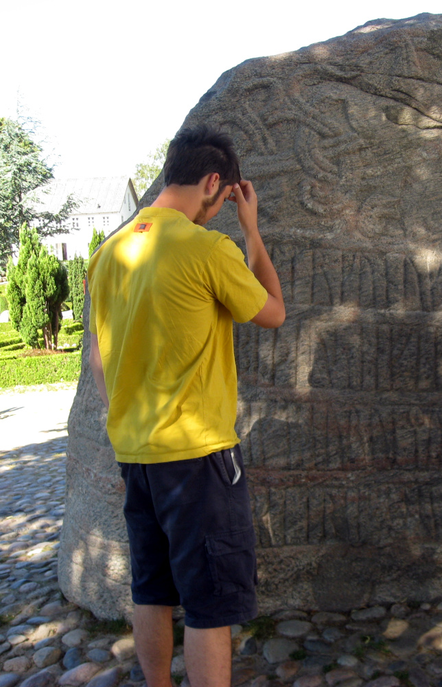

[comment]: # (progress: false)
[comment]: # (hash: true)
[comment]: # (transitionSpeed: 'fast')
[comment]: # (display: 'flex')
[comment]: # (width: 1920)
[comment]: # (height: 1080)
[comment]: # (margin: 0)

# DÆNSK

The Danish language, improved

[comment]: # (!!!)

<section class="row">

- Jellinge stone
- Danish stone

</section>
