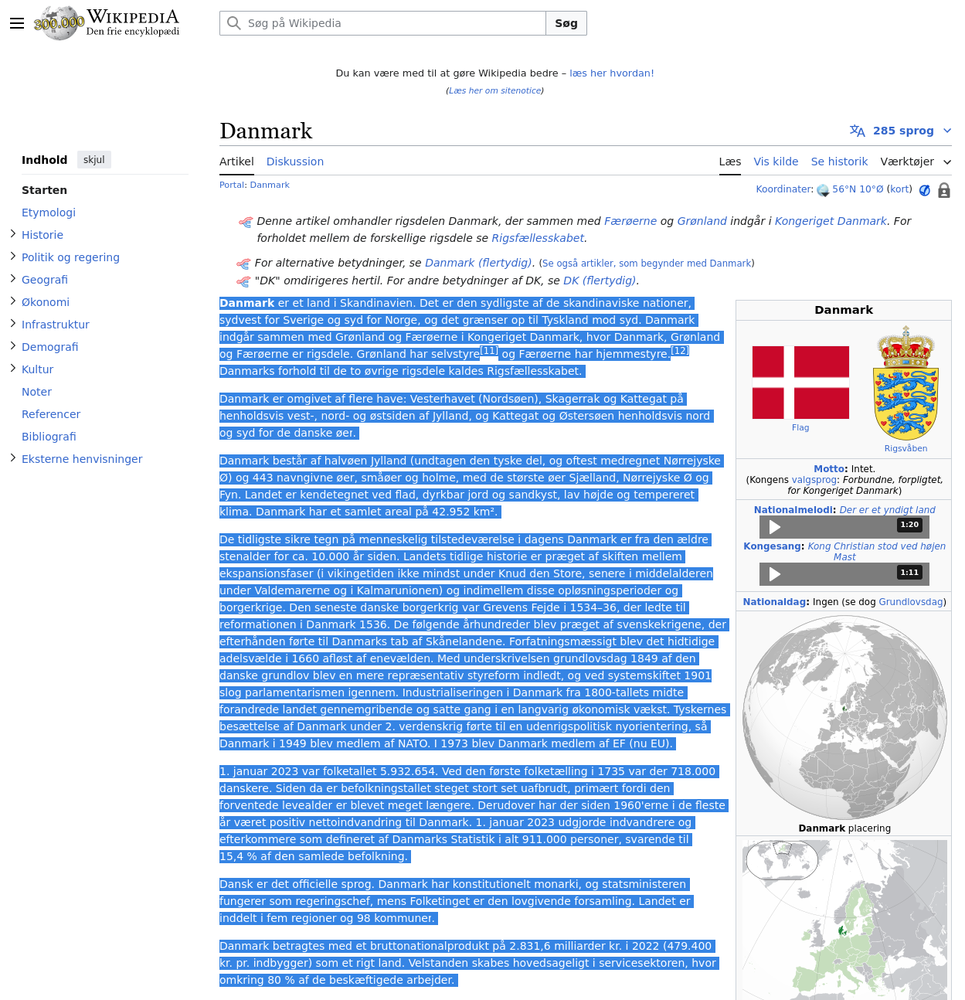
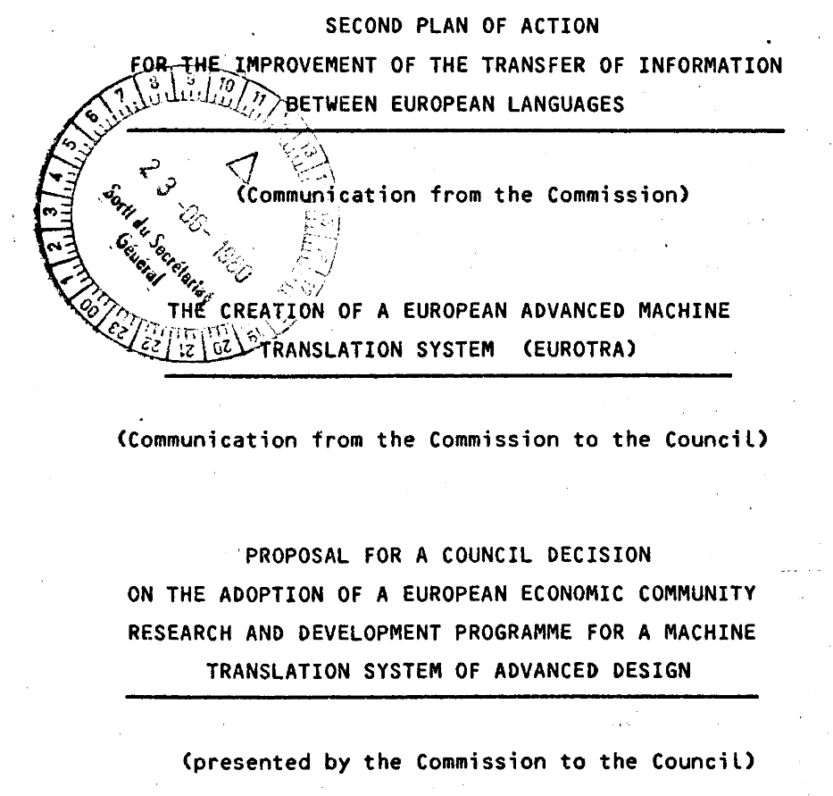
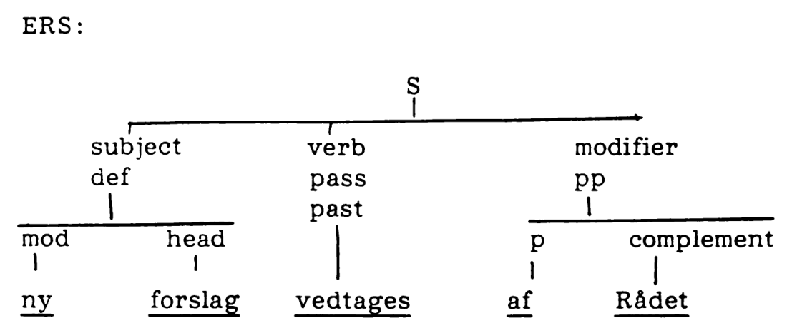
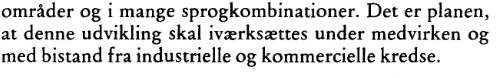
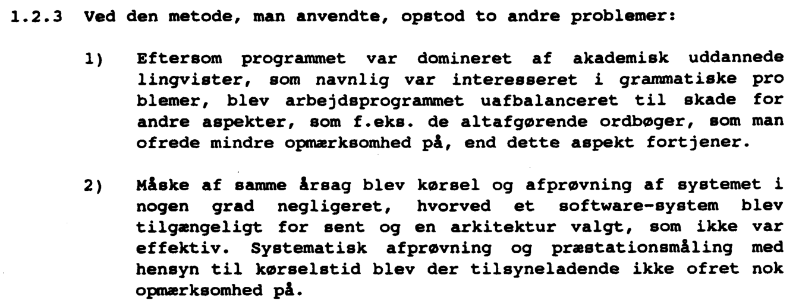
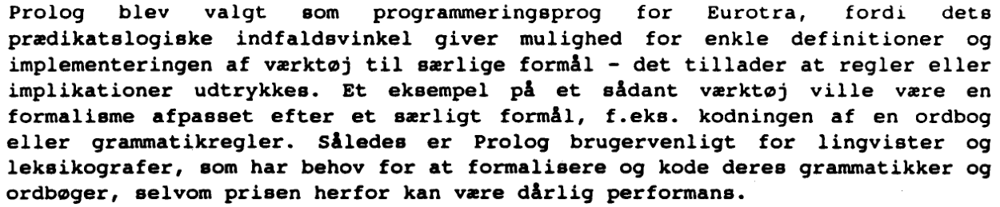
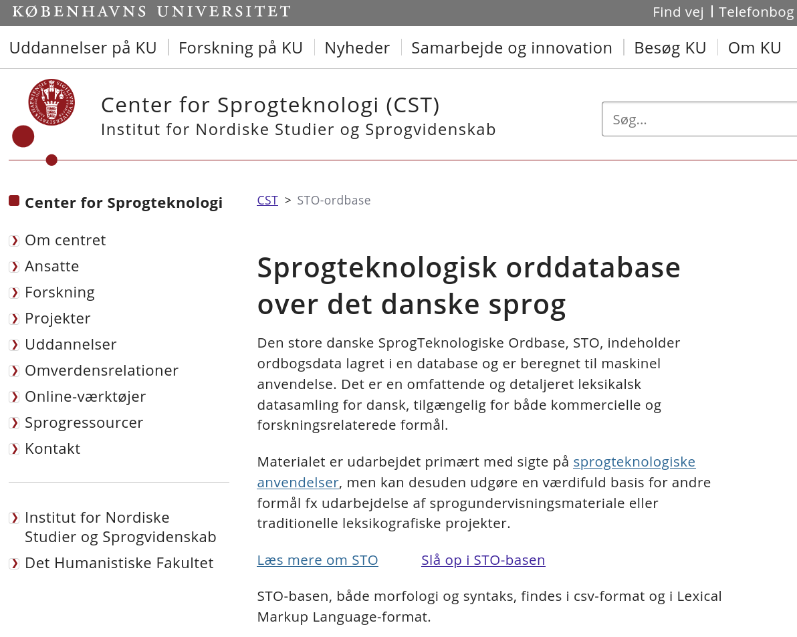

[comment]: # (progress: false)
[comment]: # (hash: true)
[comment]: # (transitionSpeed: 'fast')
[comment]: # (display: 'flex')
[comment]: # (width: 1920)
[comment]: # (height: 1080)
[comment]: # (margin: 0)

<style>
section {
  justify-content: center;
  align-items: center;
  flex-direction: column;
  font-size: 120%;
}

section.row {
  flex-direction: row;
}

.contact-information a:link {
  color: black;
}
</style>


# DÆNSK
## The Danish language, improved

Niels G. W. Serup<br>
19 July 2024
<div class="contact-information" style="font-size: 0.5em; font-family: monospace; text-align: right">

ngws@metanohi.name<br>
<https://metanohi.name><br>
<gopher://metanohi.name><br>

</div>

[comment]: # (!!!)


<div>

- Knows Danish <!-- .element: class="fragment fade-up" -->
- Knows its flaws <!-- .element: class="fragment fade-up" -->
- Can fix them <!-- .element: class="fragment fade-up" -->

</div>

[comment]: # (!!! class="row" data-auto-animate)


# Danish alphabet

ᚠ ᚢ ᚦ ᚬ ᚱ ᚴ ᚼ ᚾ ᛁ ᛅ ᛋ ᛏ ᛒ ᛘ ᛚ ᛦ

⇓

A B C D E F G H I J K L M N O P Q R S T U V W X Y Z **Æ Ø Å**

[comment]: # (!!!)


# Æ Ø Å

- åh: ah/oh
- øh: eh
- æh: uh/eh

[comment]: # (!!! data-auto-animate)

# Æ Ø Å

- åh: ah/oh
- øh: eh
- æh: uh/eh
- But also:
  - ah: ah
  - ih: ah/oh
  - uh: oh
- Also used in real words

[comment]: # (!!! data-auto-animate)


# Flaws of Danish

- Many vowel sounds
  - i, iː, y, yː, u, uː,\
    e, eː, ø, øː, ə, o, oː,\
    ɛ, ɛː, œ, œː, ɐ, ɔ, ɔː,\
    a, aː, ɑ, ɑː, ɒ, ɒː
- Big gap between spoken and written language
  - "16" is pronounced with a "j"<br>sound but spelled with a "k"

Note: These are very big flaws to fix, and I'm only one person.

[comment]: # (!!! data-auto-animate)

# Flaws of Danish

- ~~Many vowel sounds~~
- ~~Big gap between spoken and written language~~
- Focus now: **Somewhat big alphabet**
- (Other flaws to come later in the presentation)

Note: I'm going to address the two flaws indirectly, but I want to focus
on something more specific to get this going.

[comment]: # (!!! data-auto-animate)


# Somewhat big alphabet

- **Danish:**
  - Population of Danish speakers: ~6 million
  - Number of letters in alphabet: 29
  - ~4.83 μ-letters per person

<div>

- **English:**
  - Population of English speakers: ~1.5 billion
  - Number of letters in alphabet: 26
  - ~0.02 μ-letters per person

</div>
<!-- .element: class="fragment fade-up" -->
Note: This is a measure of how big a burden each speaker of the language
needs to carry.  At least in Denmark, the national language council
doesn't have the power to specify the language, but merely to describe
how it is being used.  By trimming the language down in size, it will be
easier to carry it into the future.  We can either get more Danish
speakers or simplify the alphabet, or both.

[comment]: # (!!!)


# Somewhat big alphabet

A B C D E F G H I J K L M N O P Q R S T U V W X Y Z Æ Ø Å

[comment]: # (!!! data-auto-animate)

# Somewhat big alphabet

**A** B C D **E** F G H **I** J K L M N **O** P Q R S T **U** V W X **Y** Z **Æ** **Ø** **Å**

[comment]: # (!!! data-auto-animate)

# Somewhat big alphabet

- A
- E
- I
- O
- U
- Y
- Æ
- Ø
- Å

[comment]: # (!!! data-auto-animate)

# Somewhat big alphabet

- ~~A~~
- ~~E~~
- ~~I~~
- ~~O~~
- ~~U~~
- ~~Y~~
- Æ
- Ø
- Å

Note: We already have a responsibility for these letters as speakers of
the English language, so we shouldn't have dual responsibility.

[comment]: # (!!! data-auto-animate)

# Somewhat big alphabet

- Æ
- Ø
- Å

[comment]: # (!!! data-auto-animate)

# Somewhat big alphabet

B C D F G H J K L M N P Q R S T V W X Z **Æ** **Ø** **Å**

[comment]: # (!!! data-auto-animate)

# Somewhat big alphabet

B C D F G H J K L M N P Q R S T V W X Z **Æ** **Ø** **Å**

29 - 6 = 23 letters (nice!)

[comment]: # (!!! data-auto-animate)


# DÆNSK

Note: We don't have an "a" anymore, so we'll use what sounds closest to
it.

[comment]: # (!!!)

# Going from dansk to dænsk

```sh
sed -r -e 's/[eiy]+/æ/g' -e 's/[ou]+/ø/g' -e 's/a+/å/g'
```

- e, i, y → æ
- o, u -> ø
- a -> å

Note: This is the official translation.  We collapse multiple equal
vowels into just one in order to avoid things like "æææ".

[comment]: # (!!!)


# Some improvements and almost no problems

[comment]: # (!!!)

<section class="row">


<div>

## Egyptology

- Previously:
  - "egyptologi" *or*
  - "ægyptologi"
- Now: Always just "ægæptøløgæ" <!-- .element: class="fragment fade-up" -->

</div>

</section>

Note: This is a common schism in Danish.

[comment]: # (!!!)


## snædæ

- sneede (*snowed*)
- snyde (*cheat*)

[comment]: # (!!! data-background-image="media/sne.jpg" data-background-size="contain")


## øffæcæl

- officiel (*official*)
- uofficiel (*unofficial*)

[comment]: # (!!! data-auto-animate)

## øffæcæl

- officiel (*official*)
- uofficiel (*unofficial*)

<br>

**Solution:** ikke (*not*) or **ækkæ**

- øffæcæl (*official*)
- ækkæ øffæcæl (*unofficial*)

[comment]: # (!!! data-auto-animate)

## øffæcæl

- officiel (*official*)
- uofficiel (*unofficial*)

<br>

**Solution:** ikke (*not*) or **ækkæ**

- øffæcæl (*official*)
- ækkæ øffæcæl (*unofficial*)

<br>

**Further simplification:**

- øffæcæl (*official*)
- ækøffæcæl (*unofficial*)

[comment]: # (!!! data-auto-animate)

 <!-- .element: style="width: 500px; position: absolute; top: 50px; left: 100px" -->

## fænsk

- finsk (*Finnish*)
- fynsk (*of Funen*)

 <!-- .element: style="width: 500px; position: absolute; top: 50px; right: 100px" -->


[comment]: # (!!!)


# Some improvements and almost no problems

- Only around 1% of Danish words are causing problems
- There are always workarounds


[comment]: # (!!!)


# Encoding Dænsk

**Problem:** Existing character encodings support more characters than necessary

[comment]: # (!!!)

# Encoding Dænsk: UTF-8

Already too big for normal Danish

[comment]: # (!!!)

# Encoding Dænsk: ISO-8859-1

Much better:


**But still supports too many characters**

[comment]: # (!!!)

# New encoding

- Goal: Save bytes
- Inspiration: UTF-8

[comment]: # (!!! data-auto-animate)

# ØTF-2

- Goal: Save bytes
- Inspiration: UTF-8


[comment]: # (!!! data-auto-animate)

# ØTF-TØ

- Goal: Save bytes
- Inspiration: UTF-8

[comment]: # (!!! data-auto-animate)

# ØTF-TØ

- Always at least 2 bits:
  - `0 0`: **æ**
  - `0 1`: **ø**
  - `1 0`: **å**
  - `1 1`: 5 extra bits in this case:
    - 20 spots for consonants
    - 11 spots for punctuation and symbols
    - 1 reserved
- ⇒ Each letter is represented with either 2 or 7 bits.

[comment]: # (!!! data-auto-animate)

# ØTF-TØ testing

**Idea:**

1. Find a text in Danish
2. Check how much space it takes up in UTF-8
3. Check how much space it would take up in dænsk in ØTF-TØ

[comment]: # (!!! data-auto-animate)

# ØTF-TØ testing

**Idea:**

1. Find a text in Danish

Project Gutenberg?

[comment]: # (!!! data-auto-animate)

# ØTF-TØ testing

**Idea:**

1. Find a text in Danish

~~Project Gutenberg?~~

Problem: Old Danish text doesn't use **Å**

[comment]: # (!!! data-auto-animate)

# ØTF-TØ testing



[comment]: # (!!!)

```c
#include <stdlib.h>
#include <stdio.h>
#include <unistd.h>
#include <time.h>
#include <ctype.h>

enum letter_kind {
  ae, oe, aa, other
};

int main() {
  int c;
  size_t bit_count = 0;
  enum letter_kind prev = other;

  // Assume that input is in ISO 8859-1 such that æ, ø, and å are one byte each.
  while ((c = getchar()) != EOF) {
    switch (c) {
    case 'e':
    case 'i':
    case 'y':
    case 0xe6: // æ
      if (prev != ae) {
        bit_count += 2;
        prev = ae;
      }
      break;
    case 'o':
    case 'u':
    case 0xf8: // ø
      if (prev != oe) {
        bit_count += 2;
        prev = oe;
      }
      break;
    case 'a':
    case 0xe5: // å
      if (prev != aa) {
        bit_count += 2;
        prev = aa;
      }
      break;
    default: // Like ASCII
      // Assume that input contains only non-æøå characters that are also supported in ønæcødæ.
      bit_count += 5;
      prev = other;
      break;
    }
  }

  printf("Bits: %lu\nBytes: %lu\n", bit_count, bit_count / 8);
}
```
<!-- .element: style="font-size: 15px; height: 950px;" -->

[comment]: # (!!!)

# ØTF-TØ testing

- UTF-8: 3033 bytes
- ØTF-TØ: 688 bytes
- **Over 4 times smaller**

[comment]: # (!!!)

[comment]: # (!!! data-background-image="media/æøå.svg" data-background-size="contain")


# Back to the flaws of Danish

- We have addressed an important *word-level* problem
- We have yet to do something about the *language structure*

[comment]: # (!!!)

# Central flaw

## Difficult to parse by old technology

Note: This is at least my claim.  Why is this a flaw?  Let's take a look at modern software.

[comment]: # (!!!)

# Current software

## Typical stack

1. Transistors
2. CPU
3. Operating system kernel
4. Virtual operating system kernel
5. Machine code
6. Deployed image
7. Executable file format
8. Compiler
9. Build system
10. Source code
11. Integrated development environment

Note: This is not an original point I'm making.  Software complexity is
bad, and many people are saying it.

[comment]: # (!!! data-auto-animate)

# Slightly older software

## Typical stack

1. Transistors
2. CPU
3. Operating system kernel
4. Machine code
5. Executable file format
6. Compiler
7. Source code
8. Editor

Note: This feels like a better compromise.  If we look at software from
this era, it can have lots of complexity, but the overall complexity of
the system is limited by the fewer and more expensive computing
resources available back then.

[comment]: # (!!! data-auto-animate)

# Year cutoff: *1989* <!-- .element: class="fragment fade-up" -->

 <!-- .element: height="800" class="fragment fade-up" -->

Note: For any technology that I'll use from now on, I'll make sure to
indicate that it's from before the 90's.

[comment]: # (!!!)

# Parsing troubles

Parsing: Converting text characters into structured data


Note: I have explained the flaw, but I have yet to argue that it's
actually true: Is it really hard to parse Danish by old software?  I
should also explain what I mean by parsing.

[comment]: # (!!!)

# Parsing troubles

- Great at parsing programming languages
- Less good at parsing human languages

[comment]: # (!!!)

# Modern approaches

- Machine learning based on statistical methods
- Lots of compute

Note: This is also for translation.

[comment]: # (!!!)

Note: Statistics also existed in the 80's, but it wouldn't have been
feasible for a hobbyist to really use such methods back then because of
the lack of big compute.

[comment]: # (!!! data-background-image="media/techcheck-machine-learning.svg" data-background-size="contain")

# Classic approaches

[comment]: # (!!!)

 <!-- .element: height="1000" -->

- "Danish Field Grammar in Typed Prolog"
- Year: 1986
- Uses Prolog to parse Danish for sentence analysis

Note: I found this paper over 10 years ago.  Prolog is a programming
language which we'll get into later.  Suffice it to say that it's great.

[comment]: # (!!! class="row")

[comment]: # (!!! data-background-image="media/techcheck-prolog.svg" data-background-size="contain")

# But it's slow

 <!-- .element: height="300" -->

# ... in 1986 <!-- .element: class="fragment fade-up" -->

Note: So maybe this will be fast enough today?

[comment]: # (!!!)

# Addressing the final flaw

- I claimed that Danish was hard to parse by old technology
- But this is old technology which claims to parse Danish
- Is my claim wrong?
- Let's try to parse Danish
  - Useful for analyzing and translating the language.

Note: If it turns out to be easy, then that's great, but otherwise we'll
need to simplify dænsk further.

[comment]: # (!!!)

# Searching the literature

[comment]: # (!!!)

 <!-- .element: height="1000" -->

[comment]: # (!!!)

 <!-- .element: height="165" -->


Note: The actual complaints are not relevant, but I like how the author
spends a good chunk dissing the software.

[comment]: # (!!!)

# Diderichsen?


 <!-- .element: class="fragment fade-up" -->

[comment]: # (!!!)

# More Diderichsen


 <!-- .element: class="fragment fade-up" -->

 <!-- .element: class="fragment fade-up" -->

 <!-- .element: class="fragment fade-up" -->

[comment]: # (!!!)

# Going to the source

- This is a book.
- You can get books at libraries.

[comment]: # (!!!)

[comment]: # (!!! data-background-image="media/fotos/bib0.jpg" data-background-size="contain")

[comment]: # (!!! data-background-image="media/fotos/bib1.jpg" data-background-size="contain")

[comment]: # (!!! data-background-image="media/fotos/bib2.jpg" data-background-size="contain")

[comment]: # (!!! data-background-image="media/fotos/bib3.jpg" data-background-size="contain")

[comment]: # (!!! data-background-image="media/fotos/bib4.jpg" data-background-size="contain")

[comment]: # (!!! data-background-image="media/fotos/bib5.jpg" data-background-size="contain")

# Oops

Note: The book was not actually available.

[comment]: # (!!!)

[comment]: # (!!! data-background-image="media/fotos/bib6.jpg" data-background-size="contain")

[comment]: # (!!! data-background-image="media/fotos/bib7.jpg" data-background-size="contain")

[comment]: # (!!! data-background-image="media/fotos/bib8.jpg" data-background-size="contain")

[comment]: # (!!! data-background-image="media/fotos/tbog0.jpg" data-background-size="contain")

[comment]: # (!!! data-background-image="media/fotos/tbog1.jpg" data-background-size="contain")

[comment]: # (!!! data-background-image="media/fotos/tbog2.jpg" data-background-size="contain")

[comment]: # (!!! data-background-image="media/fotos/tbog3.jpg" data-background-size="contain")

[comment]: # (!!! data-background-image="media/fotos/tbog4.jpg" data-background-size="contain")

# Problem

- Great words, but
- Not very principled approach

<br>

# Solution

- Borrow book in a more restricted manner

[comment]: # (!!!)

[comment]: # (!!! data-background-image="media/fotos/diam0.jpg" data-background-size="contain")

[comment]: # (!!! data-background-image="media/fotos/diam1.jpg" data-background-size="contain")

[comment]: # (!!! data-background-image="media/fotos/diam2.jpg" data-background-size="contain")

[comment]: # (!!! data-background-image="media/fotos/diam3.jpg" data-background-size="contain")

[comment]: # (!!! data-background-image="media/fotos/diam4.jpg" data-background-size="contain")

# Elementær dansk Grammatik by Paul Diderichsen

- Original 1946 version
- Not allowed to take it home
- The reading room closes at 18:00 on weekdays (17:00 on Fridays)

[comment]: # (!!!)

# Two main parts

[comment]: # (!!!)

[comment]: # (!!! data-background-image="media/fotos/ordlære.jpg" data-background-size="contain")

[comment]: # (!!! data-background-image="media/fotos/syntaks.jpg" data-background-size="contain")

Note: It is probably mainly this syntax part that we're interested. I
think this describes the *structure* of the language, which is what we
agreed on was missing from the starting Æ Ø Å talk.

[comment]: # (!!! data-background-image="media/fotos/udtryktønske.jpg" data-background-size="contain")

[comment]: # (!!! data-background-image="media/fotos/skaanske.jpg" data-background-size="contain")

[comment]: # (!!! data-background-image="media/fotos/sprogejendommeligheder.jpg" data-background-size="contain")

# "Fejl" = sprogejendommeligheder

*("Errors" = linguistic peculiarities)*

**⇒ We can make dænsk happen!** <!-- .element: class="fragment fade-up" -->

[comment]: # (!!!)

# But what about the syntax?

[comment]: # (!!!)

[comment]: # (!!! data-background-image="media/fotos/syntagmer.jpg" data-background-size="contain")

# Takeaways so far

- There's a finite number of words (nice!)
- There are millions of word structures (oh no!)
- Word structures consist af smaller structures stitched together (nice!)

[comment]: # (!!!)

# Example


Note: I didn't fully understand the nexus thing, but that's not so important. The important part is that there is a compositional structure that someone has described.

[comment]: # (!!!)

Note: I don't understand this.

[comment]: # (!!! data-background-image="media/fotos/skema.jpg" data-background-size="contain")

Note: But then we get to this table, which is a bit more straightforward and also shows some nice notation.

[comment]: # (!!! data-background-image="media/fotos/bisætning-hovedsætning.jpg" data-background-size="contain")

# Other linguistic sources?

[comment]: # (!!!)

[comment]: # (!!! data-background-image="media/fotos/genbrug0.jpg" data-background-size="contain")

[comment]: # (!!! data-background-image="media/fotos/genbrug1.jpg" data-background-size="contain")

[comment]: # (!!! data-background-image="media/fotos/genbrug2.jpg" data-background-size="contain")

[comment]: # (!!! data-background-image="media/fotos/genbrug3.jpg" data-background-size="contain")

[comment]: # (!!! data-background-image="media/fotos/genbrug4.jpg" data-background-size="contain")

[comment]: # (!!! data-background-image="media/fotos/genbrug5.jpg" data-background-size="contain")

[comment]: # (!!! data-background-image="media/fotos/genbrug6.jpg" data-background-size="contain")

Note: I would also recommend The Definition of Standard ML, which is also an inspiration for how to describe a language, albeit a programming one.

[comment]: # (!!! data-background-image="media/fotos/genbrug7.jpg" data-background-size="contain")

# Comma rules in Danish

[comment]: # (!!!)

[comment]: # (!!! data-background-image="media/fotos/comma0.jpg" data-background-size="contain")

[comment]: # (!!! data-background-image="media/fotos/comma1.jpg" data-background-size="contain")

[comment]: # (!!! data-background-image="media/fotos/comma2.jpg" data-background-size="contain")

[comment]: # (!!! data-background-image="media/fotos/comma3.jpg" data-background-size="contain")

[comment]: # (!!! data-background-image="media/fotos/comma4.jpg" data-background-size="contain")

[comment]: # (!!! data-background-image="media/fotos/comma5.jpg" data-background-size="contain")

[comment]: # (!!! data-background-image="media/fotos/comma6.jpg" data-background-size="contain")


# Comma takeaway

Don't have them in dænsk.

[comment]: # (!!!)


# Many more books

[comment]: # (!!!)

[comment]: # (!!! data-background-image="media/fotos/turboprolog.jpg" data-background-size="contain")

[comment]: # (!!! data-background-image="media/fotos/compling.jpg" data-background-size="contain")

[comment]: # (!!! data-background-image="media/fotos/nlu.jpg" data-background-size="contain")

[comment]: # (!!! data-background-image="media/fotos/lingstructs.jpg" data-background-size="contain")

[comment]: # (!!! data-background-image="media/fotos/categories.jpg" data-background-size="contain")

Note: I'm not going into detail on this, but you're welcome to borrow my books if you want.

[comment]: # (!!! data-background-image="media/fotos/weirdnlu.jpg" data-background-size="contain")

# Taking a step back

- Lots of 80s/early 90s literature on this approach
- Initial focus on "computerizing" Danish linguistics research from the 40s
- Focus changes a bit to also try out different representations
- General Prolog-based approach stays constant
- ⇒ We need to do something with Prolog! <!-- .element: class="fragment fade-up" -->

Note: Who am I to argue with this?  I wasn't around back then.

[comment]: # (!!!)

# Not just Denmark

- Prolog also has other implementations than PC-PROLOG from Denmark
- How was/is it used in other countries?
- What can we learn from that in order to build our own solution?

Note: Even though we're dealing with the Danish language, we can still
seek inspiration from outside the borders.

[comment]: # (!!!)

# EUROTRA


[comment]: # (!!!)

# EUROTRA today


[comment]: # (!!!)

# EUROTRA back then


[comment]: # (!!!)



Note: This was the earliest document I could find, but it mentions the
project start to be in 1978.

[comment]: # (!!!)

# The European Economic Community in 1980

[comment]: # (!!! data-auto-animate)

# The EEC in 1980

[comment]: # (!!! data-auto-animate)

# The EEC in 1980

- Members since 1957:
  - Belgium
  - France
  - West Germany
  - Italy
  - Luxembourg
  - Netherlands
- Members since 1973:
  - Ireland
  - **Denmark**

[comment]: # (!!! data-auto-animate)

# The EEC in 1980

- Languages:
  - English
  - German
  - French
  - Italian
  - Dutch
  - Danish

[comment]: # (!!! data-auto-animate)

# The EEC in 1980


Note: Danish is a small language but is nevertheless an official
language, with all the translation requirements that come with it.

[comment]: # (!!! data-auto-animate)


[comment]: # (!!!)

# Technical foundation

- $6$ languages
- $2 \cdot (5 + 4 + 3 + 2 + 1) = 30$ language pairs
- Each language has
  - an analysis module for parsing the language, and
  - a synthesis module for generating the language
- There's a common representation that languages translate to and from

[comment]: # (!!!)

# Layers

1. *ECS:* Eurotra Constituent Structure
    - Parse the language into a grammatical tree (nouns, verbs, ...)
2. *ERS:* Eurotra Relational Structure
    - Transform the ECS tree into a tree decorated with how words<br>relate
    to each other (subject, object, ...)
3. *IS*: Interface Structure
    - Transform the ERS tree into a predicate-first representation.

[comment]: # (!!! data-auto-animate)

# Layers


[comment]: # (!!! data-auto-animate)

# Layers


[comment]: # (!!! data-auto-animate)

# Layers



[comment]: # (!!! data-auto-animate)

# Layers


[comment]: # (!!! data-auto-animate)

# Great!

[comment]: # (!!! data-auto-animate)

# Ambiguities


[comment]: # (!!!)


[comment]: # (!!!)


[comment]: # (!!!)


[comment]: # (!!!)

udvikling **i** bistanden **fra** USA **til** England

X **i** Y **fra** Z **til** V

X **in** Y **from** Z **to** V

(X **in** Y) **from** (Z **to** V)

(X **in** (Y **from** Z)) **to** V

...

[comment]: # (!!!)

# Solving problems

EUROTRA was an EEC-founded project, so how did they solve these problems?

[comment]: # (!!!)

# Searching the archives


[comment]: # (!!! data-auto-animate)

# Searching the archives


[comment]: # (!!! data-auto-animate)

# Searching the archives


[comment]: # (!!! data-auto-animate)

# Searching the archives


[comment]: # (!!! data-auto-animate)

# Searching the archives


Note: With so much time to work on this, they must have solved all the problems.

[comment]: # (!!! data-auto-animate)

# Time passes

Note: The great thing about the EU archive is that all of the documents
are also in Danish. But even for Danish-speaking people this might not
be easy to read, so I'll give a short summary for each bit.

[comment]: # (!!!)

 <!-- .element: width="1600" -->

*Greece enters the EEC in 1981 (along with a new alphabet).*

[comment]: # (!!!)

 <!-- .element: width="1600" -->

*Consultants enter the picture.*

[comment]: # (!!!)

 <!-- .element: width="1400" -->

*The European Economic and Social Committee is sceptical towards The
Commission's claims of spending five years to develop the most advanced
translation system.*

[comment]: # (!!!)

 <!-- .element: width="1400" -->

*The project needs to be delayed by half a year.*

[comment]: # (!!!)

 <!-- .element: width="1400" -->

*The budget needs to be increased by 25%.*

Note: ECU = European Currency Unit (it's a bit like Hax)

[comment]: # (!!!)

 <!-- .element: width="1400" -->

*The project is expected to be finished in 1988.*

[comment]: # (!!!)

 <!-- .element: width="1400" -->

*Alternatives crop up.  Christian Rovsing suggests using Esperanto as an intermediate language.*

Note: Christian Rovsing goes bankrupt and this doesn't happen. Later the
owner becomes a member of parliament, which is confusing when searching
through the archives.

[comment]: # (!!!)

 <!-- .element: width="900" -->

*The budget increases.*

[comment]: # (!!!)

 <!-- .element: width="1400" -->

*Spain and Portugal joins the EEC. This adds another delay and budget increase.*

*There are now 72 language pairs.*

[comment]: # (!!!)

 <!-- .element: width="1400" -->
 <!-- .element: width="1400" -->

*There's an expectation that the project will need an additial<br>3-5 years once it's finished to *actually* finish.*

[comment]: # (!!!)

 <!-- .element: width="900" -->

*It's going to be so great that everyone is going to want to buy it.*

[comment]: # (!!!)

 <!-- .element: width="1400" -->

*Let's just double the budget.*

[comment]: # (!!!)

# ...

[comment]: # (!!!)

 <!-- .element: width="1900" -->

*1993: It's the final report!*

[comment]: # (!!!)

# The final report

 <!-- .element: width="1900" -->

*We never produced a good book about this, but we do have a nice manual.*

Note: The irony is of course that it was manually translated to Danish.

[comment]: # (!!!)

 <!-- .element: width="1900" -->

*We spent more time than expected.*

[comment]: # (!!!)

 <!-- .element: width="1900" -->

1. *Academics research grammars, they don't create dictionaries.*
2. *Academics write papers, they don't write maintainable software.*

[comment]: # (!!!)

 <!-- .element: width="1900" -->

*Prolog is still great! The performance could be better!*

[comment]: # (!!!)

 <!-- .element: width="1900" -->

*In the future let's maybe try this machine learning instead.*

[comment]: # (!!! data-auto-animate)

 <!-- .element: width="1900" -->

*~~In the future let's maybe try this machine learning instead.~~*

[comment]: # (!!! data-auto-animate)

# Let's remake EUROTRA

- Seems like a good idea!
- Computers are much faster today, so we can happily use Prolog.

[comment]: # (!!!)

# Checklist

1. Find a dictionary of
    - Danish words
    - Danish grammar structures
2. Write a program that analyzes Danish sentences
3. Future work: Do the actual translation

[comment]: # (!!!)

# Dictionary



[comment]: # (!!!)

# Example

```xml
<SubcategorizationFrame id="Dv3xNP0-ned-på">
  <feat att="naming" val="trivalent (phrasal): NP, NP, PP part=ned prep=på"/>
  <feat att="example" val="Han ridsede bogstavet ned på pladen"/>
  <feat att="constructionId" val="Cv3NP0-på"/>
  <LexemeProperty>
    <feat att="partOfSpeech" val="verb"/>
    <feat att="selfId" val="NED_have_NO_NO"/>
    <feat att="reflexiveVerb" val="no"/>
    <feat att="takesParticle" val="ned"/>
    <feat att="takesAuxiliary" val="have"/>
    <feat att="passiveVerb" val="no"/>
    <feat att="modal" val="no"/>
    <feat att="auxiliary" val="no"/>
  </LexemeProperty>
  <SyntacticArgument>
    <feat att="positionNumber" val="1"/>
    <feat att="syntacticFunctionType" val="subject"/>
    <feat att="optional" val="no"/>
    <feat att="syntacticConstituentLabel" val="NP"/>
    <feat att="syntacticConstituentPhraseId" val="subjectNominativeCase"/>
    <feat att="case" val="nominativeCase"/>
    <feat att="reflexiveVoice" val="no"/>
    <feat att="expletive" val="no"/>
    <feat att="definiteness" val="unspecified"/>
    <feat att="npIndex" val="I"/>
  </SyntacticArgument>
  <SyntacticArgument>
    <feat att="positionNumber" val="2"/>
    <feat att="syntacticFunctionType" val="directObject"/>
    <feat att="optional" val="no"/>
    <feat att="syntacticConstituentLabel" val="NP"/>
    <feat att="syntacticConstituentPhraseId" val="accusativeCase"/>
    <feat att="case" val="accusativeCase"/>
    <feat att="reflexiveVoice" val="unspecified"/>
    <feat att="expletive" val="no"/>
    <feat att="definiteness" val="unspecified"/>
    <feat att="npIndex" val="J"/>
  </SyntacticArgument>
  <SyntacticArgument>
    <feat att="positionNumber" val="3"/>
    <feat att="syntacticFunctionType" val="prepositionalComplement"/>
    <feat att="optional" val="yes"/>
    <feat att="syntacticConstituentLabel" val="PP"/>
    <feat att="syntacticConstituentPhraseId" val="PÅ_NP_NOC_NOC"/>
    <feat att="introducer" val="på"/>
    <feat att="ppComplementLabel" val="NP"/>
  </SyntacticArgument>
</SubcategorizationFrame>
```
<!-- .element: style="font-size: 14px; height: 820px;" -->

[comment]: # (!!!)

# Example

```xml
<SubcategorizationFrame id="Dv3xNP0-ned-på">
  <LexemeProperty>
    <feat att="partOfSpeech" val="verb"/>
    <feat att="takesParticle" val="ned"/>
  </LexemeProperty>
  <SyntacticArgument>
    <feat att="positionNumber" val="1"/>
    <feat att="syntacticFunctionType" val="subject"/>
    <feat att="optional" val="no"/>
    <feat att="syntacticConstituentLabel" val="NP"/>
    <feat att="case" val="nominativeCase"/>
  </SyntacticArgument>
  <SyntacticArgument>
    <feat att="positionNumber" val="2"/>
    <feat att="syntacticFunctionType" val="directObject"/>
    <feat att="optional" val="no"/>
    <feat att="syntacticConstituentLabel" val="NP"/>
    <feat att="case" val="accusativeCase"/>
    <feat att="definiteness" val="unspecified"/>
  </SyntacticArgument>
  <SyntacticArgument>
    <feat att="positionNumber" val="3"/>
    <feat att="optional" val="yes"/>
    <feat att="introducer" val="på"/>
    <feat att="ppComplementLabel" val="NP"/>
  </SyntacticArgument>
</SubcategorizationFrame>
```
<!-- .element: style="font-size: 18px; height: 590px;" -->

<br>

"**Han** ridsede **bogstavet** **ned** **på** **pladen**"

*"**He** scratched **the letter down onto the board**"*

[comment]: # (!!!)

# Tech stack

XML

⇓

Prolog

[comment]: # (!!! data-auto-animate)

# Tech stack

XML

⇓

?

⇓

Prolog

[comment]: # (!!! data-auto-animate)

# Tech stack

XML

⇓

**Haskell**

⇓

Prolog

[comment]: # (!!! data-auto-animate)

[comment]: # (!!! data-background-image="media/techcheck-haskell.svg" data-background-size="contain")

[comment]: # (!!! data-background-image="media/techcheck-miranda.svg" data-background-size="contain")

1. Generate a Haskell datatype from the XML DTD
2. Parse all XML files at build time and embed them as compressed data <!-- .element: class="fragment fade-down" -->
3. Compile the data into Prolog files <!-- .element: class="fragment fade-down" -->
4. Compile the Prolog files into an executable <!-- .element: class="fragment fade-down" -->
5. Run the executable in order to analyze Danish <!-- .element: class="fragment fade-down" -->

**DEMO TIME** <!-- .element: class="fragment fade-down" -->

[comment]: # (!!!)

# Taking another step back

This entire detour was just an attempt to prove myself wrong...

... but maybe I was right? <!-- .element: class="fragment fade-in" -->

[comment]: # (!!!)

## Difficult to parse by old technology

This still seems like the central flaw.

Note: The parsing itself can probably be done without too much trouble,
but translating between different languages is definitely still hard
this way.

[comment]: # (!!!)

# Fixing the right thing

- We have tried to improve the state-of-the-art 80s tooling
- What if we instead improve the language itself?

Note: Put in another way: If it's hard to build a tool for a language
because of complexity, you can either improve the tool or improve the
language.  I want to improve the language.

[comment]: # (!!!)

# Syntax in dænsk

- Needs to be regular
  - **No** exceptions
- Needs to be something you can also speak
  - This excludes predicate-based representations

[comment]: # (!!!)

# Word types

Typical elements in Germanic languages:

- Nouns
- Verbs
- Adjectives
- Adverbials
- Prepositions
- Conjunctions
- ...

[comment]: # (!!! data-auto-animate)

# Word types

- Nouns
- Verbs
- ~~Adjectives~~
- ~~Adverbials~~
- ~~Prepositions~~
- ~~Conjunctions~~
- ~~...~~

**Stick to SV and SVO**

Convert any other word type to noun or verb

Note: IF parsers were the original "disregard how language works, we
redefine it to be simpler" approaches.

[comment]: # (!!! data-auto-animate)

# Examples

[comment]: # (!!!)

<div style="text-align: left;">

Anden indrettede sig efter forholdene

*The duck adjusted to the conditions*

- Anden (*noun*)
- indrettede (*verb*)
- sig (*reflexive verb identifier*)
- efter (*preposition*)
- forholdene (*noun*)

</div>

[comment]: # (!!! data-auto-animate)

- Subject
  - Anden (*noun*)
- "Verb"
  - indrettede (*verb*)
  - sig (*reflexive verb identifier*)
  - efter (*preposition*)
- "Object"
  - forholdene (*noun*)

[comment]: # (!!! data-auto-animate)

- "Verb"
  - indrettede (*verb*)
  - sig (*reflexive verb identifier*)
  - efter (*preposition*)

[comment]: # (!!! data-auto-animate)

- "Verb"
  - indrettede (*verb*)
  - eftersig (*preposition-reflexive verb identifier*)

[comment]: # (!!! data-auto-animate)

- "Verb"
  - eftersigindrettede (*preposition-reflexive verb*)

[comment]: # (!!! data-auto-animate)

- Subject
  - Anden (*noun*)
- "Verb"
  - eftersigindrettede (*preposition-reflexive verb*)
- "Object"
  - forholdene (*noun*)

[comment]: # (!!! data-auto-animate)

Anden indrettede sig efter forholdene

↓

Anden eftersigindrettede forholdene

↓

Åndæn æftærsægændrættædæ førhøldænæ

**Super easy to parse!**

[comment]: # (!!! data-auto-animate)

De klipser den fast

(*They clip it on to something*)

↓

De fastklipser den

↓

Dæ fåstklæpsær dæn

Note: This can cause an explosion in the number of verbs, but it's
simpler, and it's so broken anyway.

[comment]: # (!!!)

Vægtstangsprincippet fungerer dårligt

(*The barbell principle does not work well*)

↓

Vægtstangsprincippet dårligtfungerer

↓

Vægtstångspræncæppæt dårlægtføngærær

Note: This is an example with adverbials.

[comment]: # (!!!)

Han giver penge til butikken

(*He gives money to the shop*)

↓

Han tilpengegiver butikken

↓

Hån tælpængægævær bøtækkæn

Note: This is an example with accusative.


[comment]: # (!!!)

# Regarding translation

Will need simplified languages for the targets as well:

- Deutsch → Dæøtsch
- français → frånçåæs
- italiano → ætålæånø
- Nederlands → Nædærlånds
- ...

[comment]: # (!!!)

# Conclusion

- Languages have a lot of legacy
- You can remove that legacy
- Making people use it is still hard

[comment]: # (!!!)

# Links and attribution

<div style="text-align: left; font-size: 20px;">

ønæcødæ: https://github.com/nqpz/-n-c-d-

Prolog experiment: https://github.com/nqpz/ordbase

Tutankhamun mask:<br>
Roland Unger, CC BY-SA 3.0 <https://creativecommons.org/licenses/by-sa/3.0>,<br>
via Wikimedia Commons https://commons.wikimedia.org/wiki/File:CairoEgMuseumTaaMaskMostlyPhotographed.jpg

Funen map:<br>
Los688, CC BY 3.0 <https://creativecommons.org/licenses/by/3.0>,<br>
via Wikimedia Commons https://commons.wikimedia.org/wiki/File:Location_map_Funen.svg

</div>
